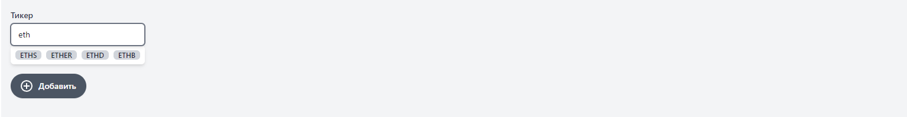
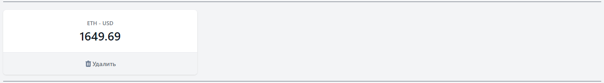
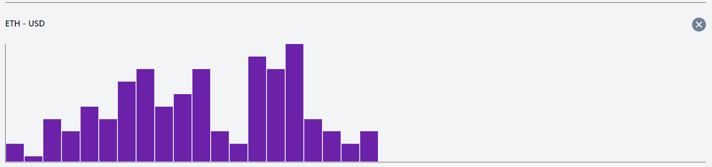
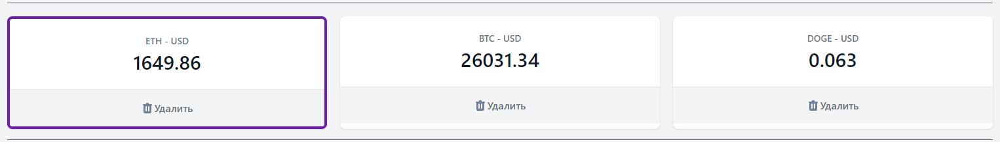

# [Cryptonomicon](https://cryptonomicon-vue3.netlify.app/)
[](https://app.netlify.com/sites/cryptonomicon-vue3/deploys)

Проект веб-приложение арбитража криптовалют
### Возможности
Поиск любой криптовалюты

Отображение ее стоимости в реальном времени 

Построение графика изменения ценности
(в зависимости от торгов)

Закрепление нескольких валют



### Технологии
VUE3 \
TailWindCSS \
[CryptoCompare API](https://min-api.cryptocompare.com/)

### Для запуска проекта:

Важно иметь Node Packet Manager последней стабильной версии

```
npm install
```

### dev

```
npm run serve
```

### build

```
npm run build
```

### lint

```
npm run lint
```
Приложение будет запущено на порту 8080

### Что можно улучшить:
В ситуациях когда невозможно просчитать стоимость относительно
USD, можно делать дополнительный запрос на расчет стоимости к 
BTC, и еще один для расчета BTC к USD

